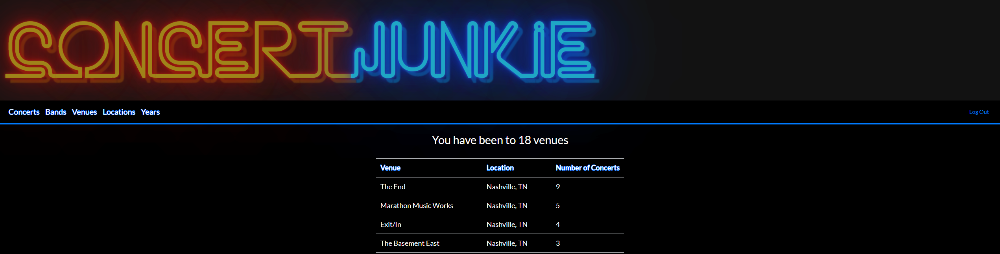

# Concert Junkie

**A front-end capstone project from [Evan Reynolds](https://www.linkedin.com/in/evanmaxreynolds/) for Nashville Software School C40.**

### **Concert Tracker**

**Description:** I created an app that allows users to track concerts that they've been to as well as total number of artists/bands seen, total number of venues/locations they've been too, and how many concerts they attended per year. Users can also upload photos and videos of the concerts.

**Purpose:** The reason I created this app is because I go to concerts as often as I can and sometimes I forget what artists/bands I've seen or where I've seen them. I wanted something to be able to track all that information and it's nice to look back and previous concerts to trigger forgotten memories.

---

### **To run this code:**

1. Clone it down

1. Go to your terminal of choice and create a new folder
1. Copy the SSH key in git hub
1. In your terminal write: git clone `git@github.com:evanreynolds1116/Capstone-Concert_Junkie.git`

1. Launch from Terminal 

1. `cd` into Capstone-Concert_Junkie
1. `npm install`
1. `npm start` \*If doesn't open automatically then paste http://localhost:3000 in your browser.

1. Now launch JSON file

1. `cd Capstone-Concert_Junkie/api`
1. `json-server -p 5002 -w concert-junkie.json`

### **Using Concert Junkie:**

---

- Register and account \*Note: this is not true authentication. DO NOT STORE SENSITIVE INFORMATION. Email addresses and passswords are saved openly in the JSON database and not protected.

1. Click "Register" to create an account
2. Fill out the form and click "Register" at the bottom. You will be automatically signed and and redirected to the home page

3. Once you are at the home page, this is where you will see any tracked concerts you've added

4. To track a new concert, click the "+ Add New Concert" button and fill out the form
  - When typing in a band, location, or venue, it will automaticall display search results from the database
  - If what you are typing in is not found in the database, click the "Add" button next to the search bar to add it to the database
5. Once you have filled out the form, click the "Add Concert" button to submit and be redirected back to the home page that displays your concerts.

6. If you would like to see information about a concert, click the "Details" button on the right side of the concert

7. From here you can edit or delete the concert and you can also upload a tour poster, photos, or videos of the concert using Cloudinary.

8. If you click "Bands" on the nav bar, you will see the number of total bands you've seen as well as each band and the number of times you've seen them

9. If you click "Venues" on the nav bar, you will see the number of total venues you been to as well as each venue and the number of times you've been there

10. If you click "Locations" on the nav bar, you will see the number of total locations (city/state) you've been to as well as each location and the number of times you've been there

11. If you click "Years on the nav bar, you will see the number of concerts you been to per year

### **Techologies Used**

---

To build this app the following were used:

- This project was bootstrapped with [Create React App](https://github.com/facebook/create-react-app).

- [React Router](https://reacttraining.com/react-router/) for page routing
- [Reactstrap](https://reactstrap.github.io/components/navbar/) and [Bootstrap](https://getbootstrap.com/) for prebuilt components
- [React-Bootstrap-Typeahead](https://github.com/ericgio/react-bootstrap-typeahead) to display search results while typing
- [Cloudinary](https://cloudinary.com/) to upload photos and videos
- [ChartJS](https://www.chartjs.org/) to make line charts

### Skills Utilized 

1. API Calls: POST, PUT, DELETE, GET
1. Javascript: Objects, Arrays, Functions, etc.
1. Persistent data storage with JSON sercer
1. Github Scrum workflow
1. CSS
1. Semantic HTML
1. React: hooks, props, routes
1. Modular code

## Troubleshooting

If you are having trouble getting the application running:

- Double check your file paths to make sure they are in the right directories
- Make sure all dependencies are installed
- Check to make sure your servers are correct. Should be `localhost:3000` for app and `localhost:5002` for the JSON server.
- Contact me through my linkedin and I would be happy to try and help (https://www.linkedin.com/in/evanmaxreynolds/)